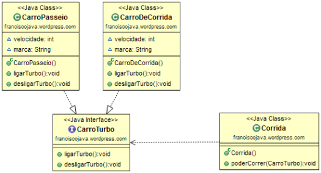

# :tada: Interfaces em Java :tada:

As interfaces em **Java** é uma forma de contrato, que a classe ao assinar, tem a responsabilidade de  implementar os seus métodos.

## :memo: Licença
Esse projeto está sob a licença MIT. Veja o arquivo [LICENSE](LICENSE) para mais detalhes.
